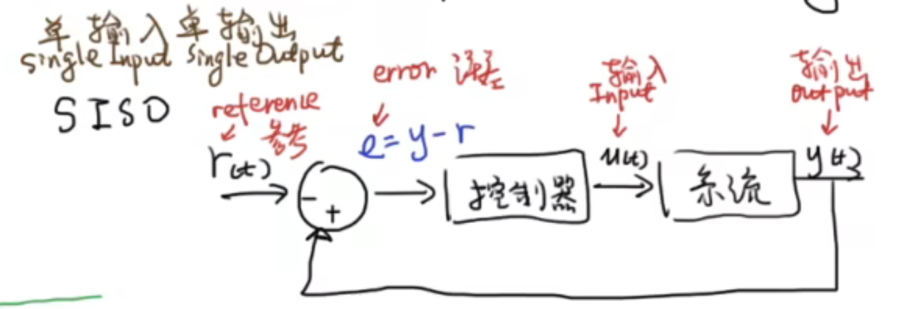

## 最优控制（Optimal Control）

在**约束条件**下，通过选择控制输入 $u(t)$（或 $u_k$）使性能指标 $J$ 最小。

### SISO（单输入单输出）

常见连续时间二次型损失函数：

$$
J=\int_{0}^{T}\left(q\,e(t)^2+r\,u(t)^2\right)\,dt
$$

- **$e(t)$**：误差（跟踪时常取 $e(t)=y(t)-r_{\text{ref}}(t)$；调节到 0 时常取 $e(t)=y(t)$）
- **$u(t)$**：控制输入（标量）
- **$q\ge 0$**：误差权重
- **$r>0$**：控制权重
- **$T$**：时域长度（有限时域；$T\to\infty$ 时对应无穷时域，如 LQR）

直觉：$q e^2$ 让系统更“贴目标”，$r u^2$ 让控制别太用力。

### MIMO（多输入多输出，矩阵形式）

连续时间线性状态空间模型：

$$
\dot{x}(t)=Ax(t)+Bu(t)
$$

输出方程（最常用形式）：

$$
y(t)=Cx(t)
$$

误差向量（跟踪）：

$$
e(t)=y(t)-r_{\text{ref}}(t)
$$

二次型损失函数（矩阵版）：

$$
J=\int_{0}^{T}\left(e(t)^\top Q\,e(t)+u(t)^\top R\,u(t)\right)\,dt
$$

- **$x(t)\in\mathbb{R}^n$**：状态向量
- **$u(t)\in\mathbb{R}^m$**：输入向量
- **$y(t)\in\mathbb{R}^p$**：输出向量
- **$A,B,C$**：系统矩阵
- **$Q\succeq 0$**：误差权重矩阵
- **$R\succ 0$**：输入权重矩阵

### 例子：二维系统（调节到 0）

$$
\frac{d}{dt}\begin{bmatrix}x_1\\x_2\end{bmatrix}
=
A\begin{bmatrix}x_1\\x_2\end{bmatrix}
+
B\begin{bmatrix}u_1\\u_2\end{bmatrix}
$$

取输出为状态（$y=x$），参考为 0（$r_{\text{ref}}=0$）：

$$
y=\begin{bmatrix}y_1\\y_2\end{bmatrix}=\begin{bmatrix}x_1\\x_2\end{bmatrix},\quad
r_{\text{ref}}=\begin{bmatrix}0\\0\end{bmatrix},\quad
e=y-r_{\text{ref}}=\begin{bmatrix}x_1\\x_2\end{bmatrix}
$$

若选择对角权重：

$$
Q=\begin{bmatrix}q_1&0\\0&q_2\end{bmatrix},\quad
R=\begin{bmatrix}r_1&0\\0&r_2\end{bmatrix}
$$

则有：

$$
e^\top Q e
=
\begin{bmatrix}x_1&x_2\end{bmatrix}
\begin{bmatrix}q_1&0\\0&q_2\end{bmatrix}
\begin{bmatrix}x_1\\x_2\end{bmatrix}
=q_1x_1^2+q_2x_2^2
$$

$$
u^\top R u
=
\begin{bmatrix}u_1&u_2\end{bmatrix}
\begin{bmatrix}r_1&0\\0&r_2\end{bmatrix}
\begin{bmatrix}u_1\\u_2\end{bmatrix}
=r_1u_1^2+r_2u_2^2
$$

## MPC (模型预测控制)
通过系统模型预测未来一段时间内的状态/输出，在**有限预测时域**上求一个最优的输入序列；但实际执行时只执行第一个输入，然后下一拍再次优化（**滚动时域 / receding horizon**）。

### 离散系统模型

采样时刻 $k$：

$$
x_{k+1}=Ax_k+Bu_k,\quad y_k=Cx_k
$$

跟踪误差（输出跟踪）：

$$
e_k=y_k-r_{\text{ref},k}
$$

### 预测时域 $N_p$ 与控制时域 $N_c$

- **预测时域 $N_p$（prediction horizon）**：往未来预测多少步
- **控制时域 $N_c$（control horizon）**：允许优化多少步的控制输入
- 常见关系：$N_c\le N_p$

当“控制区间 < 预测区间”时，经常采用：

$$
u_{k+i|k}=u_{k+N_c-1|k},\quad i\ge N_c
$$

### MPC 优化问题

在时刻 $k$，求解输入序列 $\{u_{k|k},\dots,u_{k+N_c-1|k}\}$：

$$
\min \;
J=
\sum_{i=0}^{N_p-1}
\left(
e_{k+i|k}^\top Q\,e_{k+i|k}
+
u_{k+i|k}^\top R\,u_{k+i|k}
\right)
+
e_{k+N_p|k}^\top F\,e_{k+N_p|k}
$$

- **$Q$**：误差权重矩阵（越大越重视跟踪误差）
- **$R$**：输入权重矩阵（越大越“省力/更平滑”）
- **$F$**：终端误差权重（可选）

### 执行流程

1. **测量/估计**当前状态 $x_k$
2. **求解优化问题**，得到最优序列 $u_{k|k}^*,u_{k+1|k}^*,\dots$
3. **只执行第一个控制量**：$u_k=u_{k|k}^*$
4. 令 $k\leftarrow k+1$，回到第 1 步（滚动时域）