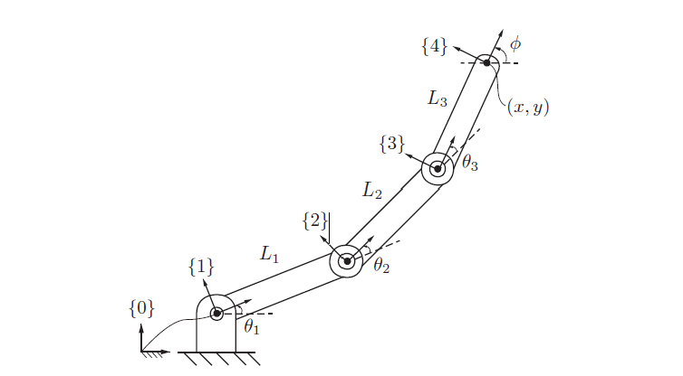
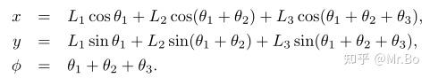
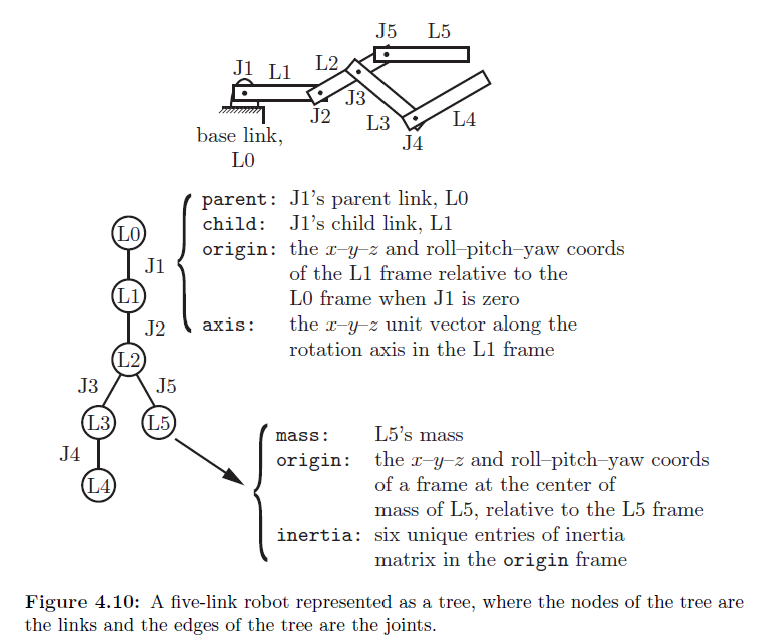

## Ch04 Forward_Kinematics 正运动学

机器人**正运动学**：给定关节变量 $q$（角度/位移），计算末端执行器坐标系相对基座坐标系的位姿



末端执行器的坐标可以表示为：


使用上面的描述方法显然连杆和关节数变多时会十分复杂，因此我们在连杆上附加坐标系，例如图中的 {1}，{2}，{3}，此时这个开链机械臂的正运动学方程就可以用转换矩阵 $T$ 来描述：

### 位姿的表示：齐次变换矩阵（$SE(3)$）

通常用齐次变换矩阵表示位姿：

$$
T =
\begin{bmatrix}
R & p\\
0 & 1
\end{bmatrix},
\quad R\in SO(3),\; p\in\mathbb{R}^3
$$


末端相对基座的位姿可以写成：

$$
T_{04} = T_{01}\,T_{12}\,T_{23}\,T_{34}
$$


式中（$\theta_1,\theta_2,\theta_3$ 为关节角，$L_1,L_2,L_3$ 为连杆长度）：

$$
T_{01} =
\begin{bmatrix}
\cos\theta_1 & -\sin\theta_1 & 0 & 0\\
\sin\theta_1 & \cos\theta_1  & 0 & 0\\
0 & 0 & 1 & 0\\
0 & 0 & 0 & 1
\end{bmatrix},
\quad
T_{12} =
\begin{bmatrix}
\cos\theta_2 & -\sin\theta_2 & 0 & L_1\\
\sin\theta_2 & \cos\theta_2  & 0 & 0\\
0 & 0 & 1 & 0\\
0 & 0 & 0 & 1
\end{bmatrix}
$$

$$
T_{23} =
\begin{bmatrix}
\cos\theta_3 & -\sin\theta_3 & 0 & L_2\\
\sin\theta_3 & \cos\theta_3  & 0 & 0\\
0 & 0 & 1 & 0\\
0 & 0 & 0 & 1
\end{bmatrix},
\quad
T_{34} =
\begin{bmatrix}
1 & 0 & 0 & L_3\\
0 & 1 & 0 & 0\\
0 & 0 & 1 & 0\\
0 & 0 & 0 & 1
\end{bmatrix}
$$

此外，常用一个“零位姿/初始位姿”矩阵 $M$ 表示当所有关节角都为 0 时末端的位姿：

$$
M =
\begin{bmatrix}
1 & 0 & 0 & L_1+L_2+L_3\\
0 & 1 & 0 & 0\\
0 & 0 & 1 & 0\\
0 & 0 & 0 & 1
\end{bmatrix}
$$

---

## DH vs PoE：两种常见的 FK 建模写法

- **Denavit–Hartenberg parameters（D–H, DH）**：通过一套“坐标系放置规则”，把相邻连杆的变换写成标准形式，再连乘得到 $T_{0n}$。
- **Product of Exponentials（PoE）**：用每个关节的旋量轴与矩阵指数表示关节运动，再连乘得到 $T(q)$：

$$
T(q) = e^{[S_1]q_1}\,e^{[S_2]q_2}\cdots e^{[S_n]q_n}\,M
$$

---

## URDF 与正运动学

URDF（Universal Robot Description Format）是 ROS 里常用的机器人描述文件（**语法是 XML**），可描述机器人的运动学结构、惯性参数与几何/碰撞信息；ROS 有对应的解析器。

URDF 更擅长描述**开链/树结构**，不能直接表达典型的闭链（例如 Stewart 平台）。

在 URDF 文件中，机器人的基本元素是 `link`（连杆）与 `joint`（关节）：




从 FK 的视角：一个关节 = 一个“从 parent 到 child 的变换”

`joint`定义了 parent/link 与 child/link 的相对关系。对 FK 来说，你可以把一个关节看成：

$$
T_{\text{parent}\rightarrow\text{child}}(q)
= T_{\text{origin}}\;\cdot\;\mathrm{Rot}(\hat a, q)
$$

- $T_{\text{origin}}$：URDF `<origin xyz=... rpy=...>` 给出的**零位姿变换**（固定不变）
- $\hat a$：URDF `<axis xyz=...>` 给出的关节轴（在 joint 坐标系里）
- $q$：关节变量（revolute/prismatic 对应角度/位移）

也就是说：**URDF 的正运动学就是把每个 joint 的变换连乘起来**（robot_state_publisher 就在做这件事）。

### 一个例子

来自`so101_new_calib.urdf` 

```xml
<joint name="shoulder_pan" type="revolute">
  <origin xyz="0.0388353 -8.97657e-09 0.0624" rpy="3.14159 4.18253e-17 -3.14159"/>
  <parent link="base_link"/>
  <child link="shoulder_link"/>
  <axis xyz="0 0 1"/>
  <limit effort="10" velocity="10" lower="-1.91986" upper="1.91986"/>
</joint>
```


- `type="revolute"`：转动关节，变量是角度 $q$
- `<origin ...>`：定义“关节零位”时，**child 相对 parent** 的固定变换 $T_{\text{origin}}$  
  - `xyz`：单位 **米**（m）
  - `rpy`：单位 **弧度**（rad），按 roll-pitch-yaw 顺序
- `<parent link="base_link"/>` / `<child link="shoulder_link"/>`：把这条边接到 link 树上
- `<axis xyz="0 0 1"/>`：关节绕 joint 坐标系的 $z$ 轴转
- `<limit lower/upper ...>`：关节角的上下限（单位是弧度 rad）

---

用 `fixed` 关节引入“工具坐标系/标定坐标系”，它不会带来新的自由度，只是一个固定变换：

$$
T_{\text{parent}\rightarrow\text{child}} = T_{\text{origin}}
$$

例如 `gripper_frame_joint` 把 `gripper_frame_link` 固定到 `gripper_link` 上，用于定义末端参考坐标系（方便做 IK/标定/夹爪 TCP）。

同样看一个例子：

```xml
<joint name="gripper_frame_joint" type="fixed">
  <origin xyz="-0.0079 -0.000218121 -0.0981274" rpy="0 3.14159 0"/>
  <parent link="gripper_link"/>
  <child link="gripper_frame_link"/>
  <axis xyz="0 0 0"/>
</joint>
```

它的含义就是：从 `gripper_link` 到 `gripper_frame_link` 有一个固定的 $T_{\text{origin}}$，不会随着关节变量变化。

